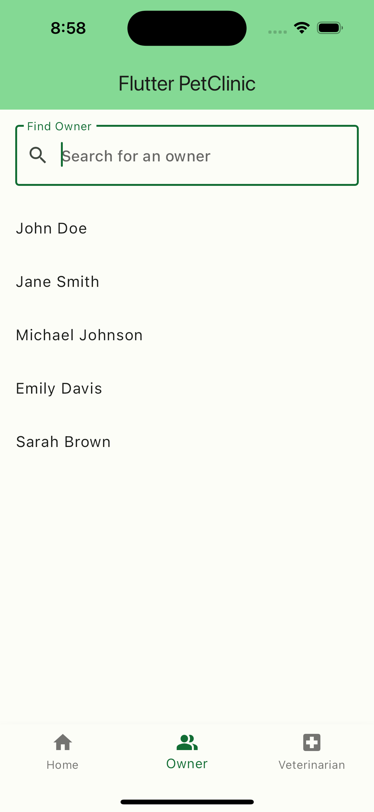

# flutter_petclinic

A new Flutter project.

## Getting Started

This project is a starting point for a Flutter application.

    
    
    

## License

This project is licensed under the [MIT License](LICENSE).
