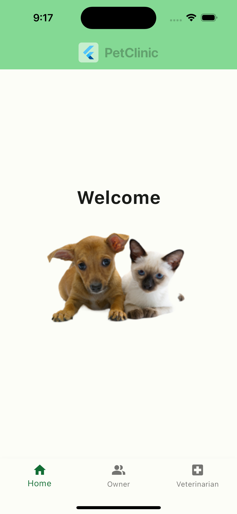

# Flutter Petclinic

A Flutter project inspired by the [Spring Petclinic](https://github.com/spring-projects/spring-petclinic). This application demonstrates how to build a modern, mobile-friendly version of the Petclinic using Flutter, following clean architecture principles.

---

## Features

- **Home Page**: A central hub to navigate the application.
- **Find Owner**: Search for pet owners by last name. View details about their pets and visits.
- **Veterinarian Page**: A list of veterinarians with their specialties.
- **Data Stubs**: Currently, the application uses mock JSON data for demonstration purposes, with plans to transition to Firebase-based REST APIs.

## Work in Progress

This project is a **work in progress** and is under active development. Future plans include:

- **Refactoring**: Improve the codebase for better modularity and scalability.
- **Dynamic Data Source**: Transition from JSON stubs to Firebase-based REST APIs.
- **New Features**: Add support for user roles, authentication, and more interactive features.

---

## Screenshots

<div style="display: flex; gap: 5px;">
    
    
    
</div>

---

## Getting Started

### Prerequisites

- Install [Flutter](https://flutter.dev/docs/get-started/install) (Flutter version 3.x or later is recommended).

### Installation

1. Clone the repository:
   ```bash
   git clone https://github.com/dcfrancisco/flutter-petclinic.git flutter_petclinic
   
   cd flutter_petclinic
   ```

2. Install dependencies:
   ```bash
   flutter pub get
   ```

3. Run the application:
   ```bash
    flutter run
    ```

## License

This project is licensed under the [MIT License](LICENSE).


## Credits
This project is inspired by the [Spring Petclinic](https://github.com/spring-projects/spring-petclinic), adapted for Flutter with a mobile-first approach.

---

### Updates:

1. **Work in Progress Section**:
   - Added a dedicated section to highlight that the project is still under development.
   - Mentioned refactoring and future enhancements.

2. **Acknowledged Potential Refactoring**:
   - Clarified plans to improve modularity and scalability.

3. **Emphasized Future Features**:
   - Highlighted planned features like Firebase integration and user roles.

---

